<span id="home"></span>
# Projeto Pokédex


<p>O Projeto Pokédex é um site constituído por três paginas, cujo objetivo é por em prática todo conteúdo que foi dado no módulo de Front-end.</p>

Projeto React e API's - link - https://crabby-owner.surge.sh/

Os conteúdos principais a serem aplicados são:

- Integração de APIs
- React Router
- Design Systems
- Estado Global

<hr/>

## Índice

- <a href="#funcionalidades">Funcionalidades do Projeto</a>
- <a href="#layout">Layout</a>
- <a href="#link">Visualizar este projeto</a>
- <a href="#comorodar">Como rodar este projeto</a>
- <a href="#requisitos">Requisitos do projeto</a>
- <a href="#tecnologias">Tecnologias Utilizadas</a>
- <a href="#author">Pessoas autoras</a>
- <a href="#next">Próximos Passos</a>

<span id='funcionalidades'></span>
## ⚒ Fucionalidades do Projeto

O Projeto Pokédex apesar do seu funcionamento ser bem simples, requer sólidos conceitos de programação, o projeto é constituído por três páginas: Home, Pokédex e Detalhes, na página Home ficam todos pokémons disponíveis e o usuário tem a possibilidade de ver mais detalhes ou capturar o pokémon, ao ser capturado é exibida uma mensagem e ele desaparece da lista de disponíveis e passa a fazer parte da pokédex, já na pokédex o usuário também pode ver mais detalhes assim como pode remover o pokémon da pokédex. A fonte de dados é uma API pública (<a href='https://pokeapi.co/'>Pokeapi</a>) que é muito utilizada para fins acadêmicos e processos seletivos.

<hr/>

<span id="layout"></span>

## ✍ Layout Desktop

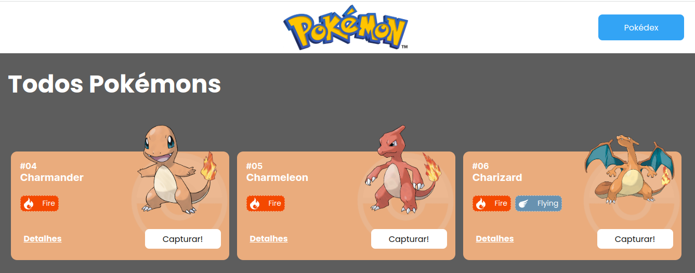
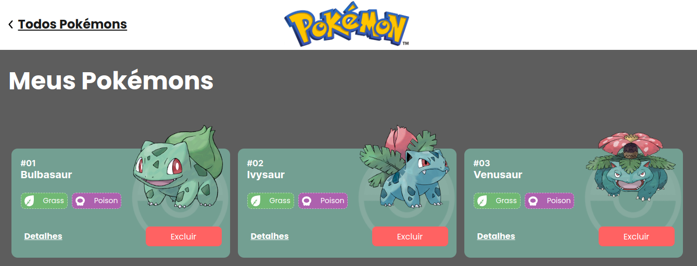
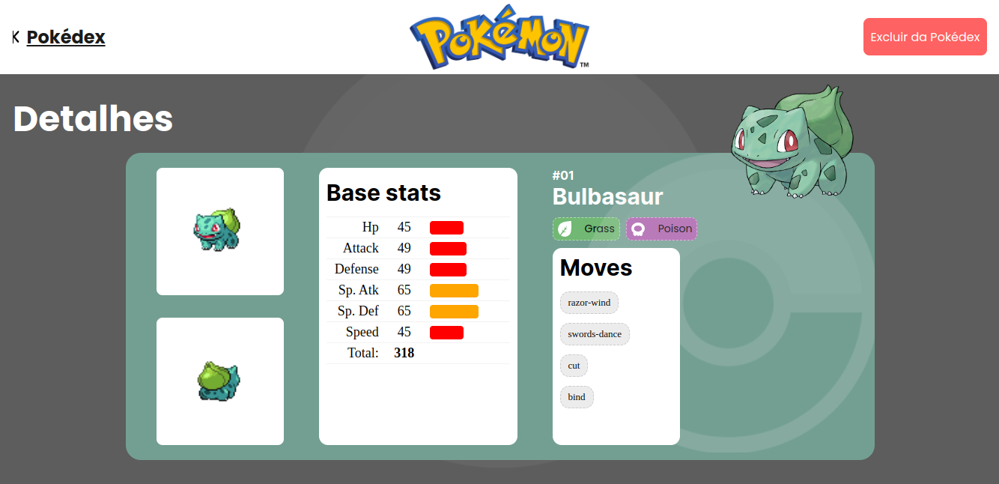

## ✍ Layout Mobile

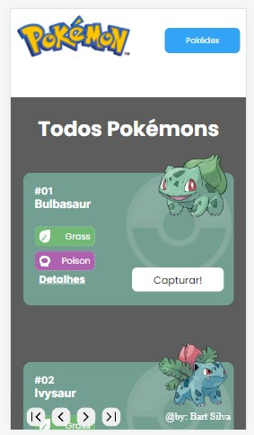
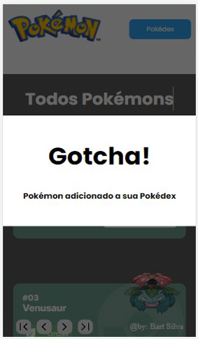
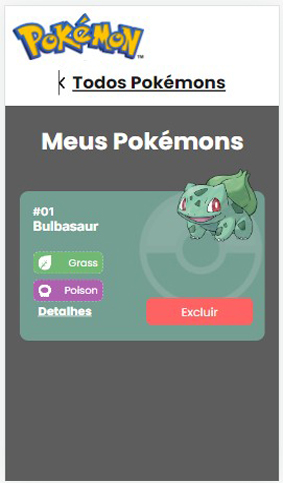
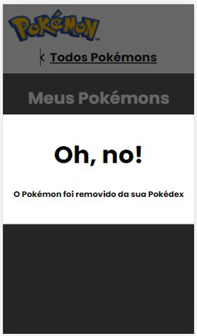
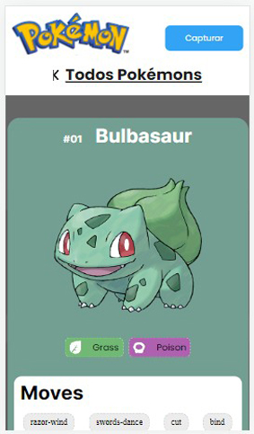
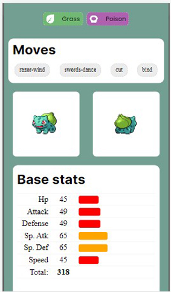

<!-- 


 -->
<hr/>

<span id="link"></span>  
## 🔗 Demonstração<br/>
[Link do projeto!](https://crabby-owner.surge.sh/).

<br/>
<span id='comorodar'></span>
 
<hr/>

## 📄 Como rodar este projeto

<p>Caso queira baixar e instalar este projeto em seu computador, é necessário que tenha o git e o node instalados.</p>

### Links:  <a href="https://nodejs.org/en">Node</a> - <a href="https://git-scm.com/">Git</a>

<p>Se já tem ambos instalados ou após instalar, siga os passos abaixo:</p>

```bash


# Abra um terminal e digite o seguinte comando

git clone (cole a url aqui)

# acesse a página criada 

cd Pokedex

# Instale as dependências
yarn install

# Executando o Projeto
yarn dev

```

<hr/>

<span id='requisitos'></span>

## Requisitos do Projeto 

### **Requisitos**
- **Gerais:**
	- [x] O site deve ter 3 páginas: Home, Pokédex e Detalhes;
	- [x] Projeto deve seguir o [design](https://www.figma.com/file/KseyA2Ofghiek2Cy3ZaDre/Poked%C3%A9x?t=AEi3zEmWmarf1FbP-0 "design") proposto;
	- [x] O fluxo de trocas de páginas devem ser semelhante ao [fluxograma](https://www.figma.com/proto/KseyA2Ofghiek2Cy3ZaDre/Poked%C3%A9x?page-id=0%3A1&node-id=2%3A2&viewport=358%2C197%2C0.27&scaling=scale-down&starting-point-node-id=2%3A2 "fluxograma");
- **Página Home:**
	- [x]  Mostrar uma lista de Pokémons, contendo ao menos 20 Pokémons;
	- [x] Cada Pokémon será representado por um Card;
	- [x] Em cada card de Pokémon tem um botão para adicioná-lo à Pokédex e um outro botão para acessar os detalhes do Pokémon;
	- [x] Header dessa página terá um botão para acessar a página da Pokédex
- **Página Pokédex**
	- [x] Renderizar a lista de pokémons adicionados na pokedex;
	- [x] Em cada card de Pokémon deve ter um botão para removê-lo da Pokédex e um outro botão para acessar os detalhes do Pokémon.
	- [x] Header deve ter um botão para voltar para a Home
	- [x] Não deve ser possível adicionar o mesmo Pokémon duas vezes na Pokédex
- **Página de Detalhes**
	- [x] Mostrar os detalhes do Pokémon selecionado, com informações descritas
	- [x] Header deve ter um botão para adicionar ou remover da Pokédex e outro para voltar a página home.

	<h4 style='color:yellow'>obs: informação no coda conflitante com este ítem acima, por esse motivo
	deixe os dois links.</h4>


	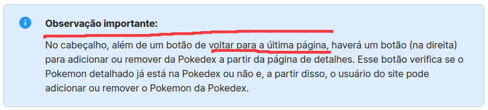
	
	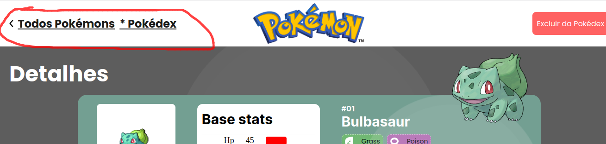

- [x] [Criar um readme](https://www.youtube.com/watch?v=1QKwP0SJK-c "Crie um readme") para o projeto;

### Funções implemetadas
```
 Além do que foi solicitado, acrecentei paginação e uma página de erro, além do botão voltar para Pokédex seguindo recomendação do coda.
```
<hr/>

## Responsividade

```
Responsivo em Desktop, Tablet e Celulares.
``` 
<hr/>

<span id="tecnologias"></span>
## 💻 Tecnologias


<hr/>

